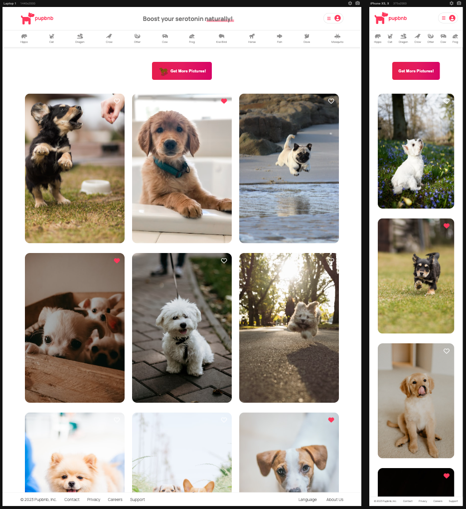

## Table of contents

- [Overview](#overview)
  - [Screenshot](#screenshot)
  - [Links](#links)
- [My process](#my-process)
  - [Built with](#built-with)
  - [Useful resources](#useful-resources)
- [Author](#author)
- [Acknowledgments](#acknowledgments)

## Overview

This is a small project using React.js. The functionality is simple: one button to refresh the picture gallery and get more puppy pictures to boost your serotonin levels! I was able to practice using React by making use of props and Hooks to pass data between components, as well as keeping the app modular by keeping all components sorted and separate.

As I keep learning about React Router, the remaining links will become functional in the future to fetch not just puppy pics, but other animals as well.

The website is also fully responsive so users should be able to:

- View the optimal layout for the site depending on their device's screen size

I'm fetching the data from Unsplash using the API from one of my Scrimba courses that was provided for students to use. My own API key has very limited use and the App wouldn't work.

### Screenshot

### Links

[live site URL here](https://pupbnb.netlify.app/)

## My process

### Built with

I used HTML, CSS, JavaScript, APIs & React, as well as Vite to build project.

### Useful resources

- [React.js website](https://reactjs.org/) - This helped me for the overall documentation as I keep learning this library.
- [Vite](https://vitejs.dev/) - Next generation frontend tooling. Much faster than using CRA - create react app via npm.

## Author

- Frontend Mentor - [@estebanp2022](https://www.frontendmentor.io/profile/estebanp2022)
